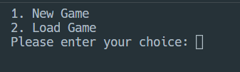

# A guide for all of you confused players....

Ok, so you might be asking.....
## WHAT THE HECK DO I DO IN THIS GAME?!
Calm down, bro....

Let me walk you through, step by step....
## Starting the game
(Actually, you see the disclaimer prompt first, but if you're here, then you probably already hit "y" on that prompt, which told you to come here)

When you start the game, you'll see the title screen:

Use integer (numerical) values for entering the inputs:
1. Starts the game, and gives this menu:
   
   If you either select `New Game` or `Load Game`, you'll be greeted with this question:
   
   And if you say 'y' the game will try to start from where you last saved (when loading a game), but it also asks something:
   
   This depends if you want to go deeper in the story, but I feel like _that_ should be removed later on in the near future (also this only happens if your friends name can't be found in the database (when loading a save))...
   
2. Goes to the options menu:
   
   Again, select integer values for either viewing the credits, changing text-speed, viewing game stats, or exiting to the main menu.
3. Exits the game, with a niiiiiiccceeee goodbye message
   
And, last but not least....
## Have fun! 😎
Also, tell me in the comments about the choices that you made along the way, or any bugs/extra stuff you can suggest.

### Random notes, by @Firepup650:
1. "Replit account" saving is recommended, even if you don't have one, as it's more reliable than file based saving
2. You do NOT have to click enter after entering input in most menus, as they do not require that, and hitting enter won't do anything (except maybe mess up some formatting)
3. If you press keys during typing animations, it WILL mess stuff up, that's not a bug, just something that cannot be fixed (as far as I am aware)

